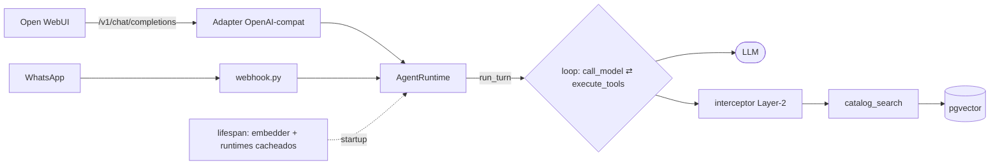

# Análisis de Arquitectura — agents-system

> **Fecha:** 2026-06-10 · **Alcance:** harness completo, capa de API y wiring de producción.
> **Veredicto:** el harness está muy bien diseñado, pero **no está conectado a ninguna
> entrada de producción**. Es un motor de Fórmula 1 sin chasis: hoy lo único que lo
> enciende son los scripts; el webhook recibe mensajes y los descarta.

---

## TL;DR

| Dimensión | Estado |
|---|---|
| Diseño del harness (capas, seguridad, multi-tenant) | ✅ sólido |
| Conexión a entradas reales (WhatsApp, web UI) | ❌ **no existe** |
| RAG sobre catálogo real | ✅ funciona (3305 embeddings) |
| Ciclo de vida / persistencia / límites en runtime | ⚠️ ausentes |

El trabajo que sigue (adapter OpenAI-compatible, agente BI) no son features sueltas:
**son la cura del problema crítico P1.**

---

## Diagrama — estado actual

```
  ENTRADAS (drivers)            HARNESS (el motor — TODO esto ANDA)         DATOS
  ──────────────────            ─────────────────────────────────          ─────

  [WhatsApp/Meta]                 ┌──────────────────────────────┐
        │                         │ loader   → def + merge +      │
        ▼                         │            invariantes ✅      │
   webhook.py                     │ injector → Layer-1 RBAC ✅     │
   ✅ verifica HMAC               │ factory  → EquippedRuntime ✅  │
   ✅ dedup (redis)               │ interceptor → Layer-2 ✅       │
   ✅ lookup client               │ AgentRuntime → loop LLM⇄tools ✅│──► LLM
   ❌ NO llama al agente          └──────────────┬───────────────┘    (Ollama/Groq/Claude)
        │                                        │
        ╳━━━━ GAP ━━━━━━━━━━━━━━━━━━━━━━━━━━━━━━━━┥ connectors:
                                                 │  • catalog_search (RAG) ──►[pgvector ✅ 3305]
  [Open WebUI]                                   │  • stubs (client/order/send)
   /v1/* ❌ NO EXISTE ━━━ GAP ━━━━━━━━━━━━━━━━━━━━┥
                                                 │
  scripts/chat.py ✅ ━━━━━━━━━━━━━━━━━━━━━━━━━━━━━┘  ← ÚNICA vía que arma el runtime hoy
```

Lo verde está probado end-to-end. Las `╳` son los dos cables que faltan.

---

## Fortalezas (cuidarlas)

| Fortaleza | Por qué importa |
|---|---|
| **Separación de capas** loader → injector → factory → interceptor → runtime | defensa en profundidad real, no decorativa |
| **Invariantes de seguridad** (`harness/loader.py`) | los deployments solo RESTRINGEN: nunca elevan permisos, autonomía ni límites |
| **Doble RBAC** | Layer-1 en build (`injector`) + Layer-2 revalidación en runtime (`interceptor`) |
| **Provider-agnostic** (`agent/graph.py`) | cambiar Ollama → Claude/Groq es una línea |
| **Multi-tenant** | `platform/roles` + `deployments/{client}` — listo para sumar clientes |
| **Async-native** | connectors async, sesión turn-scoped, el orquestador es dueño de la transacción |

---

## Problemas (priorizados, con evidencia)

| ID | Sev | Problema | Evidencia |
|----|-----|----------|-----------|
| **P1** | 🔴 Crítico | **El agente no está conectado a producción.** El webhook recibe, loguea y devuelve `ok` sin invocar el runtime. No hay endpoint de chat. Nada en `src/` llama `run_turn`. | `integration/webhook.py:100-108`; `main.py` (sin ruta de chat) |
| **P2** | 🟠 Alto | **Sin ciclo de vida del runtime.** El `lifespan` solo crea el engine; el embedder BGE-M3 (~570MB) y los runtimes se arman por invocación. Inviable por-request. | `main.py:22-31` |
| **P3** | 🟠 Alto | **Cero persistencia de conversación.** `ConversationLog` nunca se escribe; el grafo compila sin checkpointer pese a que `langgraph-checkpoint-redis` está en deps. | `models/tables.py:97`; `agent/graph.py:225` |
| **P4** | 🟠 Alto | **`execution_limits` se validan pero no se aplican.** `max_tool_calls`, timeouts viven en `loader.py`; el runtime no los recibe ni chequea. Loop sin tope real. | `harness/loader.py:63-69` vs `agent/graph.py` |
| **P5** | 🟡 Medio | **"Sensible = write/send" se queda corto para BI.** Un `SELECT` a datos sensibles no se revalida ni audita. | `harness/interceptor.py:32` |
| **P6** | 🟡 Medio | **El `.env` pisa los defaults de config.** Falta validar la config efectiva al startup. | comportamiento pydantic-settings |
| **P7** | 🟢 Bajo | **Sin métricas de costo/uso por tenant.** `tokens_used` / `model_used` existen pero vacíos. | `models/tables.py:109-110` |

---

## Roadmap de mejoras (en orden de ejecución)

| Paso | Trabajo | Resuelve | Vía |
|------|---------|----------|-----|
| 1 | Ciclo de vida: cargar embedder + cachear runtimes en `app.state` al startup | P2 | infra (prerrequisito) |
| 2 | Adapter `/v1/*` OpenAI-compat (roles como "modelos") | P1 (Open WebUI) | **SDD D-012** |
| 3 | Completar `webhook.py`: `build_runtime` + `run_turn` + responder | P1 (WhatsApp) | infra |
| 4 | Enforce `execution_limits` en el loop | P4 | TDD directo |
| 5 | Checkpointer redis + escribir `ConversationLog` | P3 | TDD / SDD chico |
| 6 | `analyst-bi` + deployment cliente + `sql_query` (revalidar read) | P5 | **SDD completo** |
| 7 | Métricas / costo por tenant | P7 | TDD directo |

**Regla de proceso:** SDD solo donde hay contrato o decisiones de diseño (pasos 2 y 6).
Los fixes mecánicos (4, 7) van con TDD directo — meterles SDD sería ceremonia.

---

## Flujo objetivo (post D-012)



---

## Próximo paso

**D-012 = ciclo de vida + adapter OpenAI-compatible**, con SDD liviano
(el análisis de este documento ES la fase de exploración). Las tres decisiones de
diseño a resolver en el `design`: **streaming** sí/no, **auth** (API key), y el
**mapeo roles-como-modelos** para `/v1/models`.
